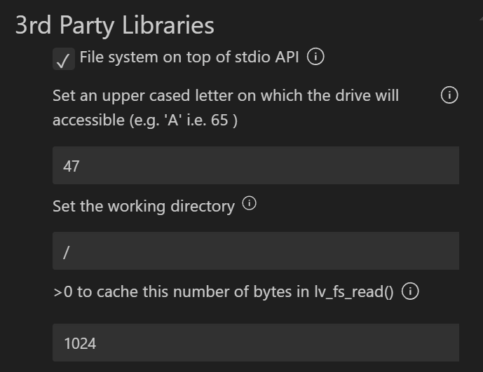

# LVGL使用8080驱动屏幕，驱动SD卡对接至LVGL  
***已知BUG***：烧录后首次启动GT911触摸无法正常工作，需手动重启  
## 介绍
1.用作本项目开发的开发板的屏幕和SD卡接口集成在扩展版上，屏幕的SPI接口和SD卡的SD卡引脚冲突，因此无法同时使用SPI驱动。虽然SPI支持挂载多个设备，但是屏幕和SD外设的频率不同，而且屏幕作为显示设备，几乎占满了SPI总线，因此只能使用两种分开的协议驱动这两种外设。  

+ 屏幕使用8080驱动，因此去除了esp_lvgl_driver组件  
+ 同时将触摸驱动独立出来，与屏幕驱动一起在lvgl_driver组件中
+ SD支持SPI和SDIO驱动，取决于宏定义,由于SDIO协议稍快，因此默认为SDIO  

## SD卡驱动  
SD卡作为一种大容量存储介质，同时支持SPI协议和SDIO协议，虽然支持四线数据传输，但是在单片机上速度提升并不明显，本项目受限于开发板，使用的一线数据传输模式。  

LVGL中的文件系统是一个抽象的模块，也就是说只是个接口，LVGL通过特定的配置访问这个接口实现对真实的文件的读写。即需要先实现一个文件系统，然后配置LVGL中的接口，才能实现LVGL对接至文件系统。

### 文件系统  
ESP-IDF中提供了VFS虚拟文件系统，可以通过乐鑫提供的接口快速实现文件系统的挂载。参考[VFS与SPIFFS文件系统](https://blog.csdn.net/Hello_kitty_ling/article/details/140087374?spm=1001.2014.3001.5502)。 通过将SD卡使用文件系统挂载在"/storage"路径下，当使用C库的标准文件读写函数时，若路径开头为"/storage"便会通过此挂载的文件系统访问SD卡中的文件。

### LVGL对接文件系统
请关注sd.c文件，只有SD相关初始化以及挂载文件系统函数，若额外写了对接LVGL文件系统的相关函数，可能导致LVGL媒体文件访问异常，我遇到过JPG解码正常，PNG显示NoData，GIF解码非常慢以及不播放的问题，*** 因此极度不推荐手动写对接LVGL文件系统的相关函数！***

使用menuconfig中的图形化配置对接LVGL的文件系统
 
第一个选项是LVGL访问文件系统的标识符，我设置的为47即'/'，而不是具体的字母，举个简单的例子。
SD挂载目录为"/storage"，C语言中的标准文件函数通过"/storage/jpg.jpg"路径可访问SD卡根目录下的jpg.jpg文件，而要使用LVGL中的读写函数访问该图片，我们首先应该在路径开头加上设置的访问文件系统的标识符即'/'，然后是文件的实际路径"storage/jpg.jpg"。当然你也可以使用字母作为标识符，不过在存在多个文件系统时访问文件会有点麻烦，可以参考[此视频](https://www.bilibili.com/video/BV1Sa41137ux/)结尾以及文件系统那节的介绍。

## 屏幕驱动
请自行阅读lv_port_disp.c文件

## 文件架构
### lvgl_driver组件下是屏幕和触摸的相关驱动  
#### lv_port_disp
此文件是显示相关的文件，使用8080驱动屏幕，修改于ESP-IDF4.4.6的LVGL的示例工程  

#### lv_port_indev
此文件是触摸相关的文件，使用I2C驱动，是将esp_lvgl_driver组件下的GT911驱动独立出来的驱动文件

### sd 文件夹
main文件夹下的sd文件夹是SD卡配置以及文件系统初始化函数