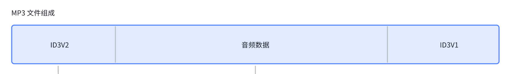
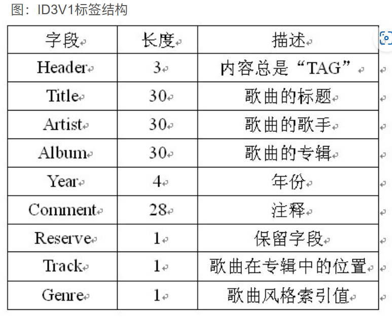
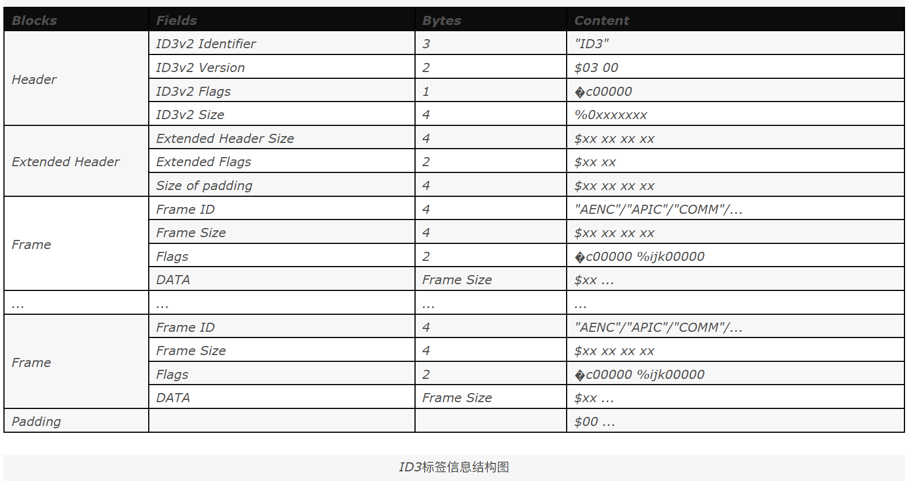
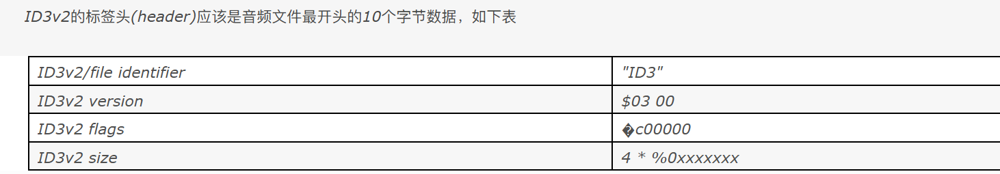
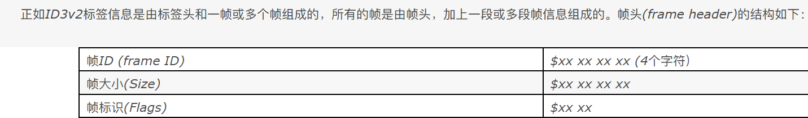

# MP3文件中的元数据
不知各位以前在使用MP3播放器时是否有一个疑问,明明我只导入了MP3音频文件,为何播放器可以获取到专辑图片,歌手等一些音乐信息,今天我们就来解开这个疑问.  
这个问题的答案就是MP3文件内的元数据,是的,MP3内不止有音频信息,在文件开头和结尾分别有ID3V2和ID3V1数据,它们存储了音频相关的信息数据.
## MP3文件及MPEG概述
MP3文件是由帧(frame)构成的，帧是MP3 文件最小的组成单位。MP3 的全称应为MPEG1 Layer-3 音频文件。  
MPEG(MovingPicture Experts Group)，MPGE音频层指MPGE文件中的声音部分，根据编码质量和复杂程度分为3层，即Layer-1、Layer2、Layer3，对应MP1、MP2、MP3三种格式文件。  

## ID3V1
在一开始MP3使用的是ID3V1标签用于存储相关字符数据,然而这个标签较为固定,在文件末尾的128字节,大小固定,且不能使用中文

## ID3V2
ID3v2是由一系列的信息块,所谓的帧(frame),构成的,而软件不需要知道这些信息块的格式。在每一个帧的开头，都有一个标记来标识这一帧(frame)的格式，内容和大小。软件可以根据帧的大小直接跳过而不用去处理它。  
如果你需要得到ID3v2的完整版本号，在ID3v2的标签头(header)内就有版本号和整个ID3v2标签信息大小的数据。  
  
因此,如果我们需要解析ID3V2,我们首先需要获取ID3v2标签头

 ID3v2的标签头(header)总是以三个字节的"ID3"字符串开头，以此来标识这是ID3v2信息。紧跟着的两个字节表示ID3v2的版本号，版本号的第一个字节表示主版本号，第二个字节表示修订号。本文是ID3v2.3.0版。所有的修订号都是向后兼容的，但主版本号不是。如果软件只支持ID3v2.2.0或最低的版本，那么它应该直接跳过ID3v2.3.0或最高版本的标签信息。主版本号和修订号绝不会是$FF。

版本号后是一个字节的标签头标识(flags)，其中只有三位是有意义的：

      a - 非同步编码(Unsynchronisation)

           标签头标识(flags)的第7位用来表示当前ID3v2信息是否经过非同步编码。当这位为1时，表示ID3v2信息经过非同步编码。

      b - 扩展标签头(Extended header)

           标签头标识(flags)的第6位用来表示标签头数据后面是否有扩展标签头数据。扩展标签头请参照第三章第二节。

      c - 测试指示位(Experimemtal indicator)

           标签头标识(flags)的第5位用来表示当前是否为测试版。如果有测试阶段，请将此位置1。

标签头标识(flags)的其它位统统要设为0。如果其中一位为1，那么程序可能不能正确识别该标签。

      ID3v2的标签信息大小是用4个字节记录。但这四个字节的最高位都设为0。所以总共有28位来表示大小。所以如果ID3v2标签信息的长度为257个字节，那么大小就是$00 00 02 01。

      这里说的大小是ID3v2信息经过非同步编码，包括扩展标签头(extended header),补白数据(padding)，但不包括标签头的大小，也就是整个ID3v2标签信息大小减去10。只用28位(256MB)是为了避免与MP3的同步信号冲突。

      可以通过以下序列来检测ID3v2的标签信息的开始：

      $49 44 33 yy yy xx zz zz zz zz

      yy小于$FF, xx是标签头标识字节，zz小于$80。
在获取标签头后,我们就可以根据标签头内的信息得知后续的ID3V2的大小了,将这些数据全部读取出来,这些数据(如果有的话)是多个帧的组合体,虽然我们希望帧是按对文件识别的重要性来排序，例如UFID,TIT2,MCDI,TRCK，但实际上帧在标签信息中的位置是不需要固定的。每个帧携带有不同类型的数据,帧的结构由帧头和帧数据组成

帧ID(4字节)是由大写英文字母A到Z，数字0到9组成的长度为4个字节的字符串。以"X","Y","Z"开头的表示是测试用途，所以所有人都可以自由使用，而无需将标签头标识中的测试指示位置1。但请记住别人可能与你使用相同的帧ID。而其它的帧ID则已被使用，或者保留作日后使用。

帧ID后是帧的大小(4字节)，帧大小用4个字节使帧头的大小刚好是10个字节。而帧大小是用帧的总大小减去帧头大小计算出来的（帧的总大小-10）。

帧大小后是两个字节的帧标识(2字节)。只定义了 6 位,另外的 10 位为 0,但大部分的情况下 16 位都为 0 就可以了。格式如下:  
abc00000 ijk00000  
+ a -- 标签保护标志,设置时认为此帧作废
+ b -- 文件保护标志,设置时认为此帧作废
+ c -- 只读标志,设置时认为此帧不能修改(但我没有找到一个软件理会这个标志)
+ i -- 压缩标志,设置时一个字节存放两个 BCD 码表示数字
+ j -- 加密标志(没有见过哪个 MP3 文件的标签用了加密)
+ k -- 组标志,设置时说明此帧和其他的某帧是一组  

值得一提的是 winamp 在保存和读取帧内容的时候会在内容前面加个'\0',并把这个字节计算在帧内容的
大小中。

帧头后的的数据就是此帧携带的信息,ID3v2标签信息应该包含至少一个帧。而帧的大小，除去帧头外至少要有一个字节。

如果数据是字符信息,则需要首先判断其编码,在数据的第一个字节,代表着编码的格式,不同的编码方式，读取的方式不一样，必须要标明，不然你输出的内容就是一堆乱码。  
+ 0代表字符使用ISO-8859-1编码方式；  
+ 1代表字符使用UTF-16编码方式；  
+ 2代表字符使用 UTF-16BE编码方式；  
+ 3代表字符使用UTF-8编码方式。  

在本例中的utf16_to_utf8()函数对UTF16数据解析成了UTF8编码  
根据帧ID标识不同类型的数据,具体表示可查看[中文文档](https://blog.csdn.net/cheetah023/article/details/52119864)  
## 解析专辑图片
专辑图片也是ID3V2中的标签,只不过内的数据为图片数据,不过并非全都是图片数据,具体可参考本例中的extract_album_art()函数

## 参考文章
[解析mp3文件，获得mp3中的专辑图片](https://blog.csdn.net/a475701239/article/details/8072616)  
[ID3v2 中文文档ver2.3.0](https://blog.csdn.net/cheetah023/article/details/52119864)  
[mp3 音频 音乐 tag ID3 ID3V1 ID3V2 标签 读取信息](https://blog.csdn.net/u013401219/article/details/48103315)
 