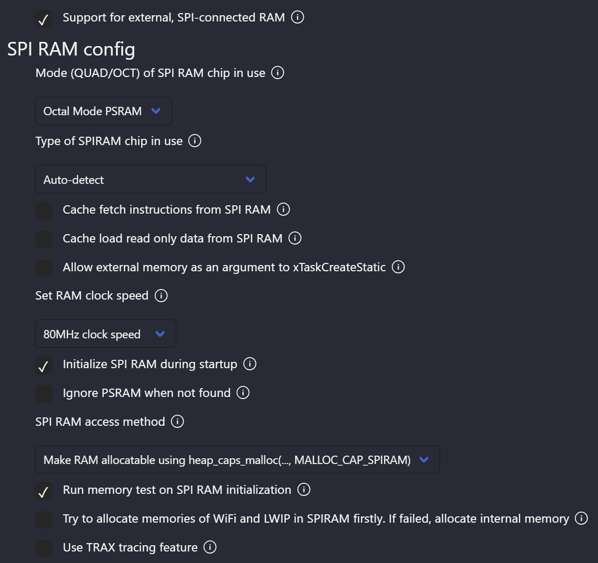

# LVGL帧率优化  
在前面的移植文章中，已经可以成功运行了lvgl，然而在滑动中的帧率并不理想，大概只有9FPS左右，同过以下的优化，我们将把滑动帧率优化至16FPS左右  

大致优化思路如下  
[增加屏幕缓存](#增大屏幕缓存)  
[使用PSRAM](#使用PSRAM)  
[增大硬件频率](#增大硬件频率)  
[打开优化](#打开优化)  

---  
---  

## 增大屏幕缓存
在移植中，lvgl的缓存是在main函数中定义的，因此我们改为全屏双缓存，加快屏幕速度
```C
//修改为全屏双缓存

// lv_color_t *buf1 = heap_caps_malloc(DISP_BUF_SIZE * sizeof(lv_color_t), MALLOC_CAP_DMA);
// assert(buf1 != NULL);
// static lv_color_t *buf2 = NULL;

// uint32_t size_in_px = DISP_BUF_SIZE;
// lv_disp_draw_buf_init(&disp_buf, buf1, buf2, size_in_px);   

static lv_color_t *buf1[DISP_BUF_SIZE] = {0};
static lv_color_t *buf2[DISP_BUF_SIZE] = {0};

lv_disp_draw_buf_init(&disp_buf, buf1, buf2, DISP_BUF_SIZE);
```  

## 使用PSRAM
+ 我使用的是ESP32S3N16R8模组，这意味着此模组拥有8M的PSRAM，根据乐鑫的说明书，在IDF设置中配置相应的SPI RAM
  

## 增大硬件频率  
+ 首先需要增加的是CPU的时钟频率，增大至最大支持的240MHZ  
  
+ 其次是FLASH的频率，需要注意的是即使是ESP32S3，不同模组的FLASH支持的总线类型也可能不一样，如果填错可能会编译报错  


## 打开优化
+ 首先打开启动优化  
  
+ 打开编译优化  
  


