# 遇到疑难问题  
## 屏幕问题  
### 屏幕不显示  
	通讯协议问题，检查原理图，将并口改为SPI协议  
### 颜色不正常  
	在LVGL设置总打开Swap the 2 bytes of RGB565 color. Useful if the display has an 8-bit interface (e.g. SPI).  

## 触摸问题（GT911）
### LVGL I2C报错ERROR 263
[I2C错误263为TimeOut](https://www.bing.com/search?q=i2c_master_cmd_begin+263&cvid=be8417f3738e423390cb2552692f6c42&gs_lcrp=EgZjaHJvbWUyBggAEEUYOTIGCAEQABhAMgYIAhAAGEAyBggDEAAYQDIGCAQQABhAMgYIBRAAGEAyBggGEAAYQDIGCAcQABhAMgYICBBFGD3SAQgyODk3ajBqMagCCLACAQ&FORM=ANAB01&PC=U531)  
	在lvgl_esp_driver组件中的i2c_manager的lvgl_i2c_init()函数中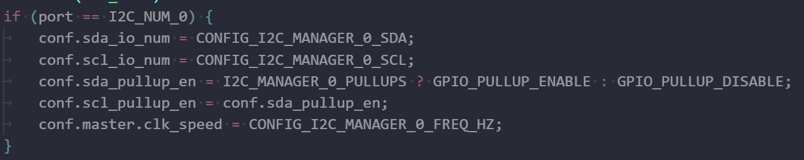可以看到sda引脚并未设置成默认上拉  
	实际电路连接中也未将I2C总线设置为上拉，故需要在LVGL TFT Display controller中打开Use ESP32 built-in bus pull-up resistors，故此错误是由于引脚设置错误导致的通讯失败  
### LVGL I2C报错ERROR -1
    烧录后开发板自行复位出现，手动重启后消失 
代码bug，已提 [issue](https://github.com/lvgl/lvgl_esp32_drivers/issues/237)  
2024.08.08:已经修复[PR](https://github.com/lvgl/lvgl_esp32_drivers/issues/238)  
说明[如下](###GT911驱动问题)

### GT911驱动问题
根据GT911的[数据手册](https://docs.espressif.com/projects/esp-dev-kits/zh_CN/latest/_static/esp32-s3-lcd-ev-board/datasheets/3.5_320x480/GT911_Datasheet_20130319.pdf)的第十页，GT911的I2C的地址是由上电时的INT和RST引脚电平变化实现的，因此需要在void gt911_init(uint8_t dev_addr)函数的开头调用相关设置函数void gt911_set_addr(uint8_t dev_addr)  
```C
// 触摸复位操作以便于设定IIC地址
void gt911_set_addr(uint8_t dev_addr){
//fix show error the first time
		gpio_config_t io_conf;
		io_conf.intr_type = GPIO_INTR_DISABLE;
		io_conf.mode = GPIO_MODE_OUTPUT;
		io_conf.pin_bit_mask = (1ULL << CONFIG_GT911_INT_PIN)|(1ULL << CONFIG_GT911_RST_PIN);
		io_conf.pull_down_en = 0;
		io_conf.pull_up_en = 0;
		gpio_config(&io_conf);
		gpio_pad_select_gpio(CONFIG_GT911_INT_PIN);
		gpio_set_direction(CONFIG_GT911_INT_PIN, GPIO_MODE_OUTPUT);
		gpio_pad_select_gpio(CONFIG_GT911_RST_PIN);
		gpio_set_direction(CONFIG_GT911_RST_PIN, GPIO_MODE_OUTPUT);

		// 设置引脚电平
		gpio_set_level(CONFIG_GT911_INT_PIN, 0);
		gpio_set_level(CONFIG_GT911_RST_PIN, 0);
		vTaskDelay(pdMS_TO_TICKS(10));
		gpio_set_level(CONFIG_GT911_INT_PIN, GT911_I2C_SLAVE_ADDR==0x29);
		vTaskDelay(pdMS_TO_TICKS(1));
		gpio_set_level(CONFIG_GT911_RST_PIN, 1);
		vTaskDelay(pdMS_TO_TICKS(5));
		gpio_set_level(CONFIG_GT911_INT_PIN, 0);
		vTaskDelay(pdMS_TO_TICKS(50));
		vTaskDelay(pdMS_TO_TICKS(50));
}
```

### LVLG DEMO启动后触摸没反应
	出现于启动lv_demo_widgets();后，若以上问题都已解决，检查在main函数中是否注册了输入设备（触控板），以下是一个示例  
```C
	lv_indev_drv_t indev_drv;
	lv_indev_drv_init(&indev_drv);
	indev_drv.read_cb = touch_driver_read;
	indev_drv.type = LV_INDEV_TYPE_POINTER;
	lv_indev_drv_register(&indev_drv);
```

### 中文显示问题
    [参考文章](../LVGL导入中文大字库/LVGL导入中文大字库.md)

# 移植步骤
## 前期准备
ESP-IDF V4.4
LVGL V8.3
lvgl_esp32_drivers

创建工程hello_world,给工程改名,并将IDF中设置为目标芯片（如ESP32S3）  
给main文件夹中的hello_world_mian.c改名为main.c,并将此文件夹中的 CMakeLists.txt 改为  
```
idf_component_register(SRCS "main.c"
                    INCLUDE_DIRS "")
```                    
在项目文件夹中创建 partitions.csv 文件,内容如下  
```
# ESP-IDF Partition Table,,,,,
# Name, Type, SubType, Offset, Size, Flags
nvs,data,nvs,     0x9000,0x6000,
phy_init,data,phy,0xf000,0x1000,
factory,app,factory,0x10000,0x70000
```
创建文件夹components  
在components文件夹中添加lvgl和lvgl_esp32_drivers组件  
将lvgl中的 lv_conf_template.h 改名为 lv_conf.h  
打开 lv_conf.h 将if 0改为if 1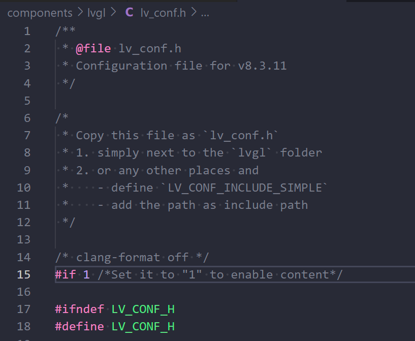  
打开 lvgl_helpers.h 在#define下添加
```C
#define SPI_HOST_MAX 3
#define LV_HOR_RES_MAX 320
#define LV_VER_RES_MAX 480
```
此时应该是可以成功编译的  

打开IDF设置选项  
+ 配置FLASH  
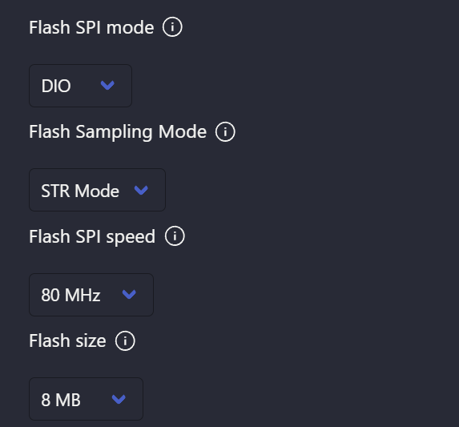  
---  
+ 使用自定义分区表  
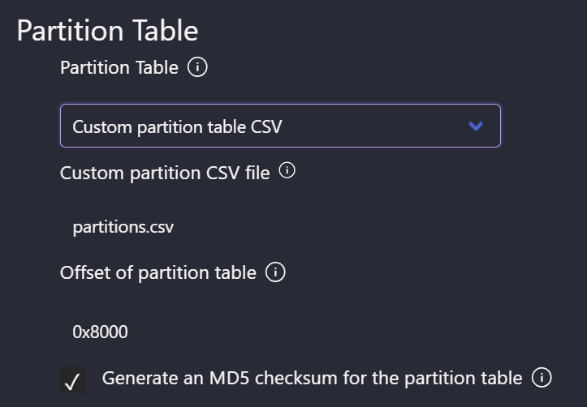
---  

---  
## LVGL配置
### 驱动配置
+ 屏幕驱动芯片配置  
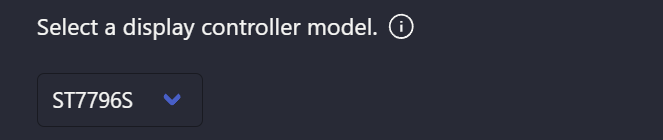  
--- 
+ 屏幕引脚配置  
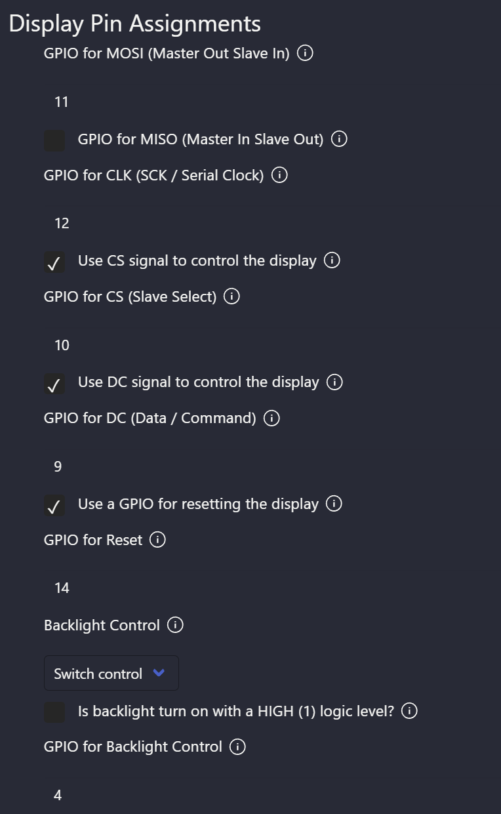  
---  
+ 触摸芯片配置  
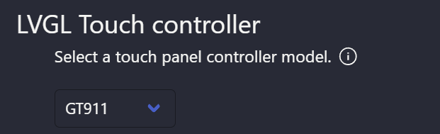  
---  
+ 触摸芯片引脚配置(I2C PORT 1有问题，应该使用I2 PORT 0)  
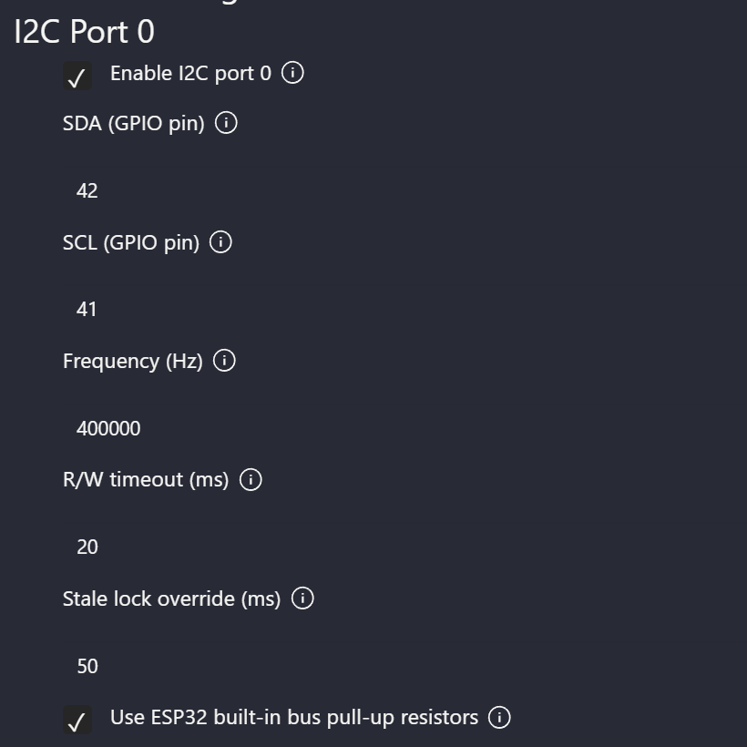
### 软件配置  
+ 打开demo  
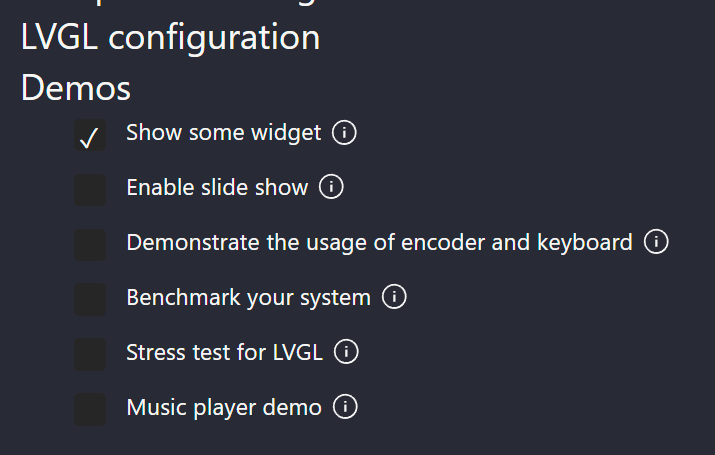  
---  
+ 打开CPU占用和帧率显示  
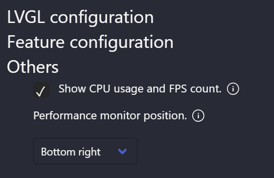  
--- 
+ 修改 LV_MEM_SIZE 为 48K  
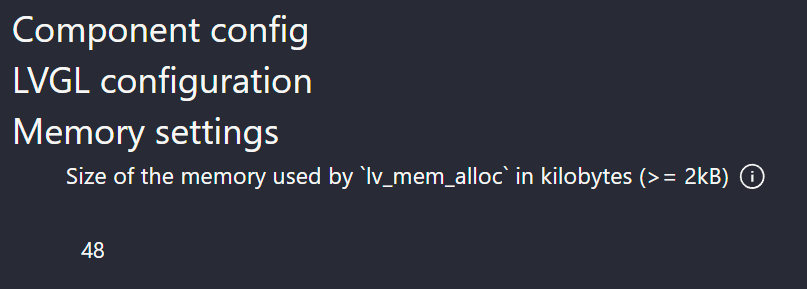  

经过以上的修改，程序已经可以正常编译并烧录进程序了，此时我们修改 main.c 中的内容
```C
#include <stdio.h>
#include "esp_log.h"
#include "esp_system.h"
#include "freertos/FreeRTOS.h"
#include "freertos/event_groups.h"
#include "lvgl.h"
#include "lvgl_helpers.h"
 
#include "demos/lv_demos.h"
 
 
#define TAG "main"
 
 
void lv_tick_task(void *arg)
{
    lv_tick_inc(1);
}
 
void app_main(void)
{
    
    /* Initialize SPI or I2C bus used by the drivers */
    lvgl_driver_init();
 
    lv_init();
    lv_color_t *buf1 = heap_caps_malloc(DISP_BUF_SIZE * sizeof(lv_color_t), MALLOC_CAP_DMA);
    assert(buf1 != NULL);
    static lv_color_t *buf2 = NULL;
 
    static lv_disp_draw_buf_t disp_buf;
 
    uint32_t size_in_px = DISP_BUF_SIZE;
    lv_disp_draw_buf_init(&disp_buf, buf1, buf2, size_in_px);
    lv_disp_drv_t disp_drv;
    lv_disp_drv_init(&disp_drv);
    disp_drv.hor_res = LV_HOR_RES_MAX;
    disp_drv.ver_res = LV_VER_RES_MAX;
    disp_drv.flush_cb = disp_driver_flush;
    disp_drv.draw_buf = &disp_buf;
    lv_disp_drv_register(&disp_drv);

    lv_indev_drv_t indev_drv;
    lv_indev_drv_init(&indev_drv);
    indev_drv.read_cb = touch_driver_read;
    indev_drv.type = LV_INDEV_TYPE_POINTER;
    lv_indev_drv_register(&indev_drv);
 
    const esp_timer_create_args_t periodic_timer_args = {
        .callback = &lv_tick_task,
        .name = "periodic_gui"};
    esp_timer_handle_t periodic_timer;
    ESP_ERROR_CHECK(esp_timer_create(&periodic_timer_args, &periodic_timer));
    ESP_ERROR_CHECK(esp_timer_start_periodic(periodic_timer, 1 * 1000));
 
    // lvgl demo演示
    // lv_demo_music();
    // lv_demo_stress();
    lv_demo_widgets(); 
   
    while (1)
    {
        /* Delay 1 tick (assumes FreeRTOS tick is 10ms */
        vTaskDelay(pdMS_TO_TICKS(10));
        lv_task_handler();
    }
 
 
}
```
修改完后虽然可以正常编译烧录，但是会无限重启，报错如下  
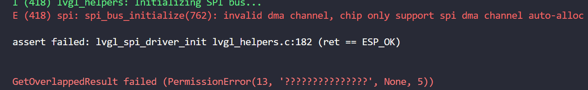  
我们需要修改lvgl_esp32_drivers中的lvgl_helpers.c文件，将SPI的DMA通道从1改为自动，这里为了方便就放整个lvgl_helpers.c文件，有兴趣可以自行对比  
```C
/**
 * @file lvgl_helpers.c
 *
 */

/*********************
 *      INCLUDES
 *********************/
#include "sdkconfig.h"
#include "lvgl_helpers.h"
#include "esp_log.h"

#include "lvgl_tft/disp_spi.h"
#include "lvgl_touch/tp_spi.h"

#include "lvgl_spi_conf.h"

#include "lvgl_i2c/i2c_manager.h"

#ifdef LV_LVGL_H_INCLUDE_SIMPLE
#include "lvgl.h"
#else
#include "lvgl/lvgl.h"
#endif

/*********************
 *      DEFINES
 *********************/

 #define TAG "lvgl_helpers"

/**********************
 *      TYPEDEFS
 **********************/

/**********************
 *  STATIC PROTOTYPES
 **********************/

/**********************
 *  STATIC VARIABLES
 **********************/

/**********************
 *      MACROS
 **********************/

/**********************
 *   GLOBAL FUNCTIONS
 **********************/

/* Interface and driver initialization */
void lvgl_driver_init(void)
{
    /* Since LVGL v8 LV_HOR_RES_MAX and LV_VER_RES_MAX are not defined, so
     * print it only if they are defined. */
#if (LVGL_VERSION_MAJOR < 8)
    ESP_LOGI(TAG, "Display hor size: %d, ver size: %d", LV_HOR_RES_MAX, LV_VER_RES_MAX);
#endif

    ESP_LOGI(TAG, "Display buffer size: %d", DISP_BUF_SIZE);

#if defined (CONFIG_LV_TFT_DISPLAY_CONTROLLER_FT81X)
    ESP_LOGI(TAG, "Initializing SPI master for FT81X");

    lvgl_spi_driver_init(TFT_SPI_HOST,
        DISP_SPI_MISO, DISP_SPI_MOSI, DISP_SPI_CLK,
        SPI_BUS_MAX_TRANSFER_SZ, 1,
        DISP_SPI_IO2, DISP_SPI_IO3);

    disp_spi_add_device(TFT_SPI_HOST);
    disp_driver_init();

#if defined (CONFIG_LV_TOUCH_CONTROLLER_FT81X)
    touch_driver_init();
#endif

    return;
#endif

#if defined (SHARED_SPI_BUS)
    ESP_LOGI(TAG, "Initializing shared SPI master");

    lvgl_spi_driver_init(TFT_SPI_HOST,
        TP_SPI_MISO, DISP_SPI_MOSI, DISP_SPI_CLK,
        SPI_BUS_MAX_TRANSFER_SZ, SPI_DMA_CH_AUTO,
        -1, -1);

    disp_spi_add_device(TFT_SPI_HOST);
    tp_spi_add_device(TOUCH_SPI_HOST);

    disp_driver_init();
    touch_driver_init();

    return;
#endif

/* Display controller initialization */
#if defined CONFIG_LV_TFT_DISPLAY_PROTOCOL_SPI
    ESP_LOGI(TAG, "Initializing SPI master for display");

    lvgl_spi_driver_init(TFT_SPI_HOST,
        DISP_SPI_MISO, DISP_SPI_MOSI, DISP_SPI_CLK,
        SPI_BUS_MAX_TRANSFER_SZ, SPI_DMA_CH_AUTO,
        DISP_SPI_IO2, DISP_SPI_IO3);

    disp_spi_add_device(TFT_SPI_HOST);

    disp_driver_init();
#elif defined (CONFIG_LV_I2C_DISPLAY)
    disp_driver_init();
#else
#error "No protocol defined for display controller"
#endif

/* Touch controller initialization */
#if CONFIG_LV_TOUCH_CONTROLLER != TOUCH_CONTROLLER_NONE
    #if defined (CONFIG_LV_TOUCH_DRIVER_PROTOCOL_SPI)
        ESP_LOGI(TAG, "Initializing SPI master for touch");

        lvgl_spi_driver_init(TOUCH_SPI_HOST,
            TP_SPI_MISO, TP_SPI_MOSI, TP_SPI_CLK,
            0 /* Defaults to 4094 */, 2,
            -1, -1);

        tp_spi_add_device(TOUCH_SPI_HOST);

        touch_driver_init();
    #elif defined (CONFIG_LV_I2C_TOUCH)
        touch_driver_init();
    #elif defined (CONFIG_LV_TOUCH_DRIVER_ADC)
        touch_driver_init();
    #elif defined (CONFIG_LV_TOUCH_DRIVER_DISPLAY)
        touch_driver_init();
    #else
    #error "No protocol defined for touch controller"
    #endif
#else
#endif
}


/* Initialize spi bus master
 *
 * NOTE: dma_chan type and value changed to int instead of spi_dma_chan_t
 * for backwards compatibility with ESP-IDF versions prior v4.3.
 *
 * We could use the ESP_IDF_VERSION_VAL macro available in the "esp_idf_version.h"
 * header available since ESP-IDF v4.
 */
bool lvgl_spi_driver_init(int host,
    int miso_pin, int mosi_pin, int sclk_pin,
    int max_transfer_sz,
    int dma_channel,
    int quadwp_pin, int quadhd_pin)
{
    assert((0 <= host) && (SPI_HOST_MAX > host));
    const char *spi_names[] = {
        "SPI1_HOST", "SPI2_HOST", "SPI3_HOST"
    };

    ESP_LOGI(TAG, "Configuring SPI host %s", spi_names[host]);
    ESP_LOGI(TAG, "MISO pin: %d, MOSI pin: %d, SCLK pin: %d, IO2/WP pin: %d, IO3/HD pin: %d",
        miso_pin, mosi_pin, sclk_pin, quadwp_pin, quadhd_pin);

    ESP_LOGI(TAG, "Max transfer size: %d (bytes)", max_transfer_sz);

    spi_bus_config_t buscfg = {
        .miso_io_num = miso_pin,
        .mosi_io_num = mosi_pin,
        .sclk_io_num = sclk_pin,
        .quadwp_io_num = quadwp_pin,
        .quadhd_io_num = quadhd_pin,
        .max_transfer_sz = max_transfer_sz
    };

    ESP_LOGI(TAG, "Initializing SPI bus...");
    #if defined (CONFIG_IDF_TARGET_ESP32C3)
    dma_channel = SPI_DMA_CH_AUTO;
    #endif
    #if defined (CONFIG_IDF_TARGET_ESP32S3)
    dma_channel = SPI_DMA_CH_AUTO;
    #endif

    esp_err_t ret = spi_bus_initialize(host, &buscfg, (spi_dma_chan_t)dma_channel);
    assert(ret == ESP_OK);

    return ESP_OK != ret;
}

```

经过以上的步骤，应该可以正常运行了，需要注意的是GT911触摸芯片在烧录后第一次会ERROR，需要手动重启设备

# 显示方向和触摸方向修改修改
## 显示方向修改
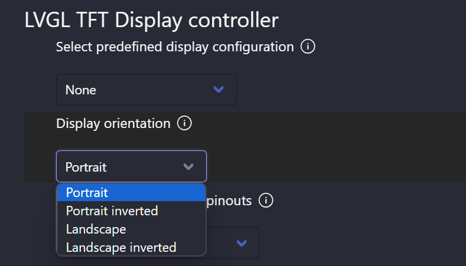  
## 触摸方向修改  
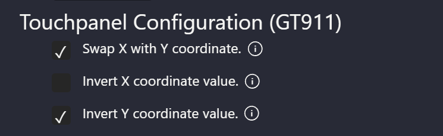  

# 工程改名
+ 工程文件夹改名
+ 工程文件夹中的CMakeLists.txt中改名
```
project(lvgl)
```
+ 工程文件夹中的MakeFile文件中的
```
PROJECT_NAME := lvgl
```