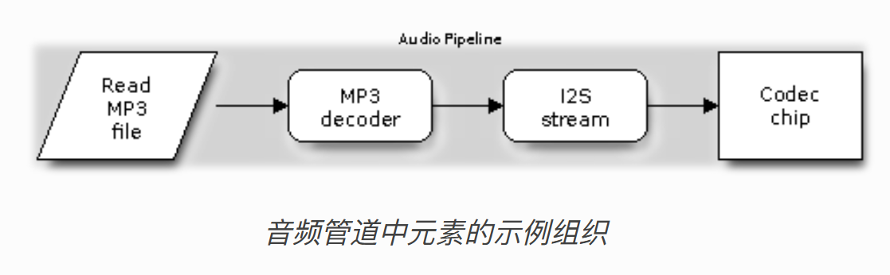

# 使用ESP-ADF播放MP3音频
***开始前请将本工程resource目录下的所有内容拷贝到sd卡中***  
ESP-ADF的乐鑫提供的音频处理框架，[ESP-ADF安装](https://www.bilibili.com/video/BV1x2421M7qh/)。虽然叫ESP-ADF，但其实只是ESP-IDF的一个组件component  
在这个框架中，乐鑫提供了一个管道(pipeline)的概览,通过将元素(element)添加到管道中,从而流式的处理音频数据  
  
音频数据从头流入到末尾,音频数据通常使用输入流获取,通常会历经编解码器(Codecs),滤波器(filter)等元素的处理,最后将处理好后的数据使用宁外一个流输出。  
在开始前，请先大致阅读以下文章，对名词大致有个概念  
[乐鑫I2S文档](https://docs.espressif.com/projects/esp-idf/zh_CN/stable/esp32/api-reference/peripherals/i2s.html)  
[音频处理的基本概览](https://blog.csdn.net/weixin_41910694/article/details/115315971)  
[ADF官方文档](https://docs.espressif.com/projects/esp-adf/en/latest/api-reference/index.html)
## MAX98357
由于我的开发板上并未集成任何的音频模块,虽然ESP32似乎有DAC功能,但是似乎很烂,考虑到质量选择了外接模块。选择这个音频模块单纯的是因为这是淘宝上能找到为数不多的外接模块,而且价格相当便宜,性能也不错,不过随后踩了很大的坑。  
MAX98357模块使用I2S协议输入,使用2.5V至5.5V电源供电,支持8kHz至96kHz采样速率,支持双声道,无需MCLK。我就随便找了个喇叭接上。  
关于SD接口，很多教程说的可不接，然而我手上这个模块不知为何非得接个什么东西才能正常工作，手也可以，金属物品也可以，反正悬空和接地就是不工作，因此使用万用表也无法得知具体原因（接表笔就工作，不接就不工作）接表笔显示3V左右，然而根据手册不工作时的电压低于0.18V好像，玄学。
## 流程概述
和本文档教程配套的V2.0版本的音频部分由pipeline_sdcard_mp3_control例程修改而来,将扫描外接sdcard中的mp3文件,随后将其放入播放列表中通过解码后将其以I2S格式传入到音频模块进行播放。  
由于MAX98357支持8kHz至96kHz采样速率,所以并不需要将音频重采样到48khz,因此取消了滤波器(filter),同时我这块开发板上也没有ADC按键,因此按键和它配套的事件也取消,只实现了播放。  
最后,请将SD卡的挂载目录设为"/sdcard",因为这是播放列表默认扫描和存储的目录。  
这个管道一共有三个元素,文件读取fatfs_stream_reader->解码mp3_decoder->i2s_stream_writer  
通过将[播放列表](#播放列表)扫描到的文件的URL设置到读取元素中,将音频模块的引脚和i2s_stream_writer元素使用的I2S端口绑定实现播放
## 播放列表
播放列表是可以按顺序或按指定顺序播放的音频文件列表。  
通过指定的目录,扫描深度,指定文件类型,会将扫描到的文件URL(相当于文件位置)传入到自定义的回调函数中,在回调函数中将URL保存到SD卡的相应位置中,后续在播放中,可以调用播放列表组件提供的相应接口获取其他歌曲的URL  
***回调函数***
```C
//将扫描到的URL资源保存到播放列表
void sdcard_url_save_cb(void *user_data, char *url)
{
    //传入的是扫描到的文件路径
    playlist_operator_handle_t sdcard_handle = (playlist_operator_handle_t)user_data;
    //保存播放列表是在sdcard_handle->playlist->offset_file与sdcard_handle->playlist->save_file
    esp_err_t ret = sdcard_list_save(sdcard_handle, url);
    // ESP_LOGE("sdcard_url_save_cb", "%s",url);
    if (ret != ESP_OK) {
        ESP_LOGE(TAG, "Fail to save sdcard url to sdcard playlist");
    }
}
```
***创建并设置播放列表***
```C
//创建一个播放列表
sdcard_list_create(&sdcard_list_handle);
//保存回调,路径,格式,
sdcard_scan(sdcard_url_save_cb, LV_FS_PATH, 1, (const char *[]) {"mp3"}, 1, sdcard_list_handle);//扫描文件
```
### 关于播放列表保存的URL文件和offset文件
URL文件毫无疑问保存的是对应格式的URL  
而offset文件在于记录每个 URL 在 save_file 中的位置和长度，以便后续读取时能够快速定位到具体的 URL,类似于数组的下标位置。  
让我们通过一个具体的例子来说明 save_url_to_sdcard 函数是如何工作的。假设我们有两个 URL，分别是 1.mp3 和 2.mp3。

保存第一个 URL (1.mp3)：  
URL: 1.mp3  
长度: 5 字节（包括字符串结束符 \0）  
首先，函数会将 1.mp3 写入 save_file，并将其偏移量和长度写入 offset_file。  
save_file 内容：
```txt
1.mp3
```
offset_file 内容：
```txt
偏移量: 0（文件开始位置）
长度: 5
```

保存第二个 URL (2.mp3)：  
URL: 2.mp3  
长度: 5 字节（包括字符串结束符 \0）  
接下来，函数会将 2.mp3 写入 save_file，并将其偏移量和长度写入 offset_file。  
save_file 内容：
```txt
1.mp3
2.mp3
```
offset_file 内容：
```txt
偏移量: 0（1.mp3 的位置）
长度: 5
偏移量: 5（2.mp3 的位置）
长度: 5
```
通过这种方式，offset_file 记录了每个 URL 在 save_file 中的位置和长度。这样在读取时，可以根据偏移量和长度快速定位到具体的 URL。
## 外设
[官方外设文档](https://docs.espressif.com/projects/esp-adf/zh-cn/latest/api-reference/peripherals/index.html)  
[外设服务文档](https://learn-esp-adf.readthedocs.io/zh-cn/latest/inside-dispatcher/periph_service.html)  
[ESP32音频框架 ESP-ADF 添加按键外设流程代码跟踪](https://blog.csdn.net/hwd00001/article/details/125459914)  
[ESP-ADF 添加按键外设流程](https://whycan.com/t_1160.html)

## 事件 监听机制 消息传递
暂无

## 后续开发
仿照[工程](https://github.com/espressif/esp-iot-solution/blob/release/v1.0/examples/hmi/mp3_example/mp3_example_cn.md),开发一个有UI界面的MP3播放器  
[参考工程](https://www.bilibili.com/video/BV12J4m1V7Yy/)

## 参考文章
[从play_mp3例程出发理解ESP32-ADF的使用方法](https://blog.csdn.net/zhejfl/article/details/86477866)  
[esp32~mp3播放实例解析](https://blog.csdn.net/bluechalk/article/details/88812633)  
[ESP32 ADF框架的 整体框架图 API手册 管道pipeline代码的整体关系介绍](https://www.bilibili.com/video/BV1xu4y1C7pa/)

## 遇到的问题 
### 无声音
如果只是想出声音的话请无脑拉高MAX98357模块的SD接口,后续想切换声道请阅读手册调整SD接口电压

### 无法使用音量控制
将i2s_stream_writer元素的初始化配置的ALC打开,音量的范围是-64到64
```C
i2s_cfg.use_alc = true;//使用音量控制
i2s_cfg.volume = -30;//range(-64,64)
```

### 没声音,警告:I2S: APLL not supported on current chip, use I2S_CLK_D2CLK as default clock source
将i2s_stream_writer元素的初始化配置APLL时钟关闭
```C
i2s_cfg.i2s_config.use_apll = false;//关闭apll时钟
```

### 和80并口屏幕冲突,有声音屏幕卡死或无显示
似乎是I2S的端口0冲突,将I2S的端口改为NUM1就解决了

### GT911报错-1,重启也无法解决
虽然GT911在使用I2C通讯似乎只使用CLK和SDA引脚,但开始错误的将I2S通讯设置为了GT911的INT和RST引脚导致报错,读取不到触摸信息,触摸失效。更换引脚后解决

### sdcard_list_show(sdcard_list_handle)不打印日志
例程屏蔽了其TAG标签,在这个语句前添加启用日志语句
```C
esp_log_level_set("PLAYLIST_SDCARD",ESP_LOG_INFO);
```