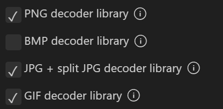
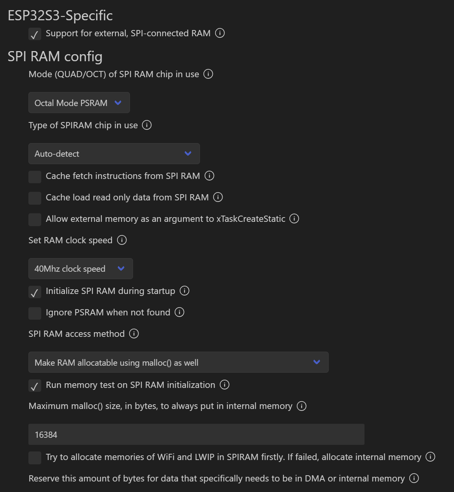
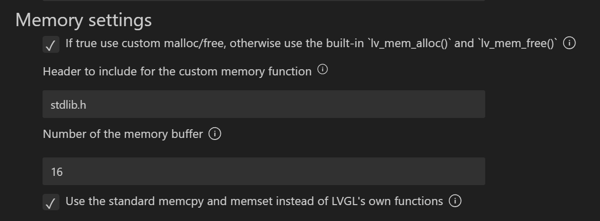
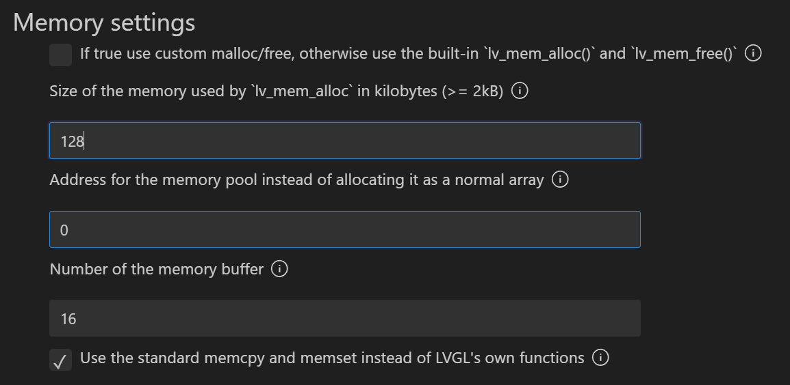

# 使用LVGL解码显示媒体文件
***已知BUG***：烧录后首次启动GT911触摸无法正常工作，需手动重启  

本篇主要介绍使用LVGL解码并显示JPG，PNG以及GIF三种常见媒体文件，在开始前请确保SD卡和文件系统工作正常并对接至了LVGL。[教程](../LVGL使用8080串口驱动屏幕，并使用SD卡/LVGL使用8080驱动屏幕，驱动SD卡对接至LVGL%20%20.md)  

首先需要确保在menuconfig中开启了解码  
  
然后设置一个较大的LVGL内存，确保图片可以正确解码显示。本教程以ESP32S3N8R16为例，因此开启了PSRAM  
  
然后设置LVGL使用C语言库申请内存  
  
若是未开启PSRAM，也可尝试此处使用128K尝试解码(未验证)  
[若内存不够可能会导致图片显示No Data](https://blog.csdn.net/weixin_45413674/article/details/127597946)（不是唯一原因）。作者在开发时也遇到过JPG成功解码，但是PNG显示No Data的问题，最后排查发现是属于文件系统对接的问题，因此此处强烈建议按照[上篇文章](../LVGL使用8080串口驱动屏幕，并使用SD卡/LVGL使用8080驱动屏幕，驱动SD卡对接至LVGL%20%20.md)设置文件系统。  

最后在界面中显示图片,无需初始化解码器类的操作，在前两步启用解码器时已经被自动启用  
```C
//创建一个IMG对象并加载SD卡中的图片解码显示,已经在ui_Switch1回调函数内做了切换图片选项
objpg =  lv_img_create(ui_Screen1);				        // 创建一个IMG对象 
// lv_img_set_src(objpg, SD_PATH"/image/test_jpg.jpg");			// 加载SD卡中的JPG图片
lv_img_set_src(objpg, SD_PATH"/image/test_png.png");	// 加载SD卡中的PNG图片
lv_obj_set_x(objpg, 47);
lv_obj_set_y(objpg, -15);
lv_obj_set_align(objpg,LV_ALIGN_CENTER);			    // 重新设置对齐

//创建一个IMG对象并加载SD卡中的图片解码显示
lv_obj_t * img = lv_gif_create(ui_Screen1);
lv_gif_set_src(img, SD_PATH"/bulb.gif");
lv_obj_set_x(img, 47);
lv_obj_set_y(img, 80);
lv_obj_set_align(img,LV_ALIGN_CENTER);			// 重新设置对齐
```