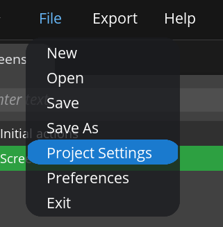

# 使用Squareline并移植到ESP32
Squareline Studio是一款图形化的界面设计工具，你可以直观的在此软件上设计你自己下UI界面，设计完后可以导出代码  

---  
本次使用环境  
+ Squareline Studio V1.4.1
+ LVGL V8.3
+ ESP-IDF V4.4.6
---  
## 使用Squareline Studio创建项目
  
按照上图方式创建项目，需要注意的是在右侧可以选择项目名字，项目存储路径以及屏幕分辨率  
LVGL版本选择8.3.6  
绘制完UI界面后在左上角选择  
  
  
再次检查分辨率，讲EXPORT FILE选为一个合适的文件夹  
注意LVGL Include Path，不同的移植LVGL路径不同，此前系列教程是lvgl.h，故此填入  
  
导出UI代码  

## 移植到ESP32上  
在ESP32的项目的main文件夹下创建一个ui文件夹，用于存储导出的UI代码，如下
  
由于是实例工程项目，并没有使用字体，图片等复杂资源，故只需导入以上文件  
新增了文件夹，对main文件夹下的CmakeList.txt文件修改，使导入的文件和头文件参与编译并可以被我们正常调用  
```
idf_component_register(SRC_DIRS "." "./ui" "./ui/screens"
                       INCLUDE_DIRS "." "./ui")
```  
在main.c文件头中包含
```
#include "ui.h"
```  
调用ui.h中的函数，编译烧录即可完成移植  
